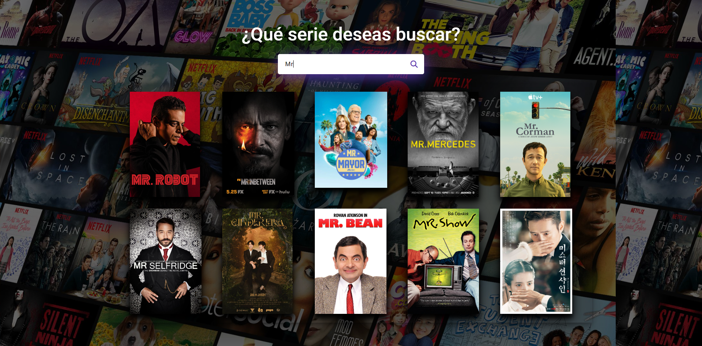
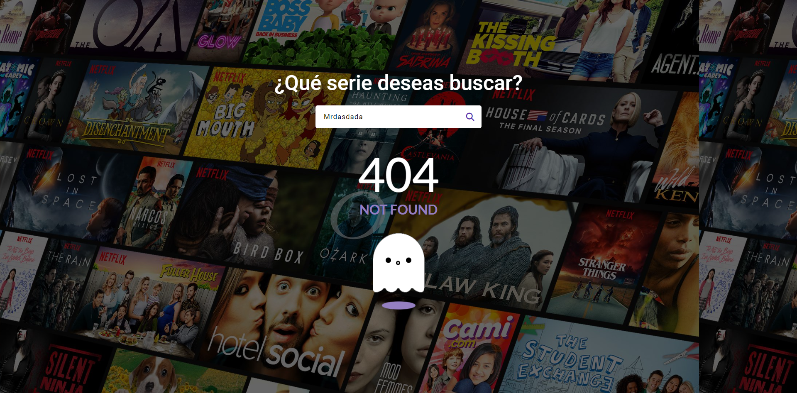
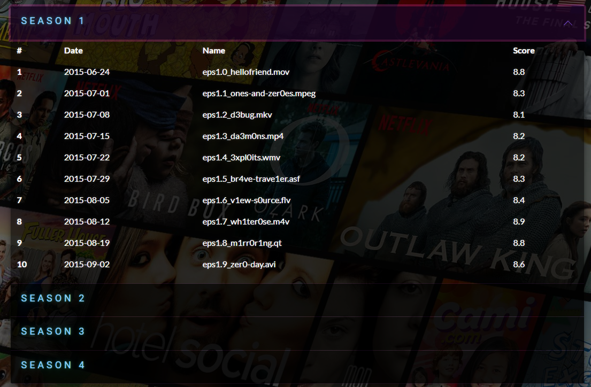
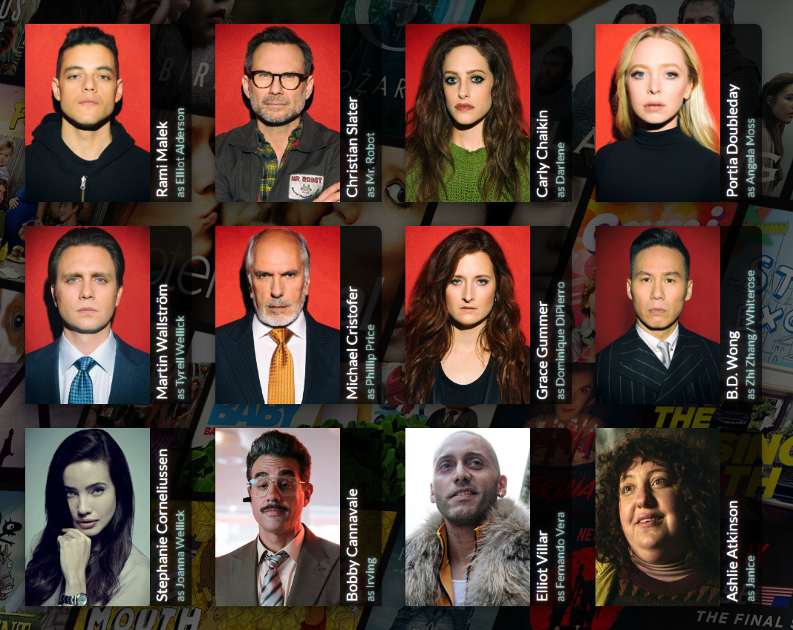

# Dev.f - React-TV-Shows-Searcher | React-Buscador-De-Series 🔍📺🔎

This is a solution to the project ✨ TV-Shows-Searcher | Buscador-De-Series ✨ of the [Kata Frontend](https://www.devf.la/master/encoding/mx).\
[Dev.f](https://www.devf.la/) offers an innovative solution to educational inclusion with EdTech programs that help people become software developers and obtain technological skills in order to obtain high-quality job opportunities in an agile and accessible way. 

## Table of contents

- [Overview](#overview)
  - [The challenge](#the-challenge)
  - [TV Maze API](#tv-maze-api)
  - [How to interact (website)](#how-to-interact-with-he-website)
  - [Screenshot](#screenshot)
  - [Links](#links)
- [My process](#my-process)
  - [Built with](#built-with)
  - [Skills](#skills)
- [Author](#author)

## Overview

### The challenge

1. Create a searcher of series consuming the "TV MAZE" API with functional React.

2. The first page should ask what TV Show do you want o search. Having already click in the input and clicked search, the searcher should throw he posible results that a user can select.

1. When selecting a TV Show it should appear an unic link (/pelicula/:idPelicula) (useParams) in the URL and show the details of the TV Show:

    1. First section: Show general information of the TV Show (image, resume, etc)
    2. Second section: Should show all the episodes divided by seasons
    3. Third section: Should show the characters and actors names, (also a profile image)

* Notes:
    - Use ESlint and for styles whatever you want.

### TV Maze API

- [Documentation](https://www.tvmaze.com/api)

### How to interact with he website

1. At first, displayed on the page you can only seen a seacher where you can write to search whatever TV Show you want.

    - If the search does not match any posible result, instead of that the page will show an 404 error.
    - If the search match with any possible result, you will see them as cards displayed in a section under of the searcher. (*Ten (10) is the maximum possible TV Shows that the page will throw*).

2. Of all the options, you can select one to accede to the details of the selected TV Show.

3. Having already selected one of them, the page will display three sections:

    1. First section: Shows general information of the TV Show, for example:
        - Image
        - Name (of the TV Show)
        - Network
        - Country Code
        - Language
        - Average rating
        - Genre
        - Show Type
        - Status
        - Summary
    2. Second section: Shows all the episodes divided by seasons in a collapsing accordion with the next details of each episode:
        - Number
        - Date
        - Name
        - Score
    3. Third section: Shows the characters and actors names, and also a profile image.

### Screenshot

1. **Entering the page**

2. **Possible TV Shows results after searching (example)**

- *Invalid search (404 error) (example)*

3. **Selected TV Show page (example)**

- *First section (general information) (example)*

- *Second section (all episodes divided by seasons into a collapsing accordion) (example)*

- *Third section (characters cards) (example)*

### Links

- GitHub Repository: [react-tv-shows-searcher-github](https://github.com/Alelsito/react-tv-shows-searcher)
- Live Site URL(Netlify): [react-buscador-de-series-netlify](https://react-buscador-de-series.netlify.app/)

## My process

### Built with

- HTML
- JS
- CSS
- [React](https://reactjs.org/) - JS library
- [Vite](https://vitejs.dev/) - Build frontend tool (in this case for React)
- [Bootswatch](https://bootswatch.com/) - For styles
- [Cdnjs](https://cdnjs.com/libraries/bootswatch) - To use Bootswatch
- [FontAwesome](https://fontawesome.com/) - For icons
- [Google Fonts](https://fonts.google.com/) - For fonts

### Skills

- APIs
- [Axios](https://axios-http.com/docs/intro)
- React library
- React Hooks:
    - [useState](https://reactjs.org/docs/hooks-state.html)
    - [useEffect](https://reactjs.org/docs/hooks-effect.html)
    - [Custom Hooks](https://reactjs.org/docs/hooks-custom.html)
- [React-Router-Dom](https://reactrouter.com/en/main)
    - [Navigate](https://reactrouter.com/en/main/components/navigate)
    - [Link](https://reactrouter.com/en/main/components/link)
    - [useParams](https://reactrouter.com/en/main/hooks/use-params)
- [NodeJS](https://nodejs.org/en/)
- [npm](https://www.npmjs.com/)
- [StandardJs](https://standardjs.com/) - as linter

## Author

- Github - [@Alelsito](https://github.com/Alelsito)
- LinkdIn - [Hugo Alejandro López Blanco](https://www.linkedin.com/in/hugolopezblanco/)
